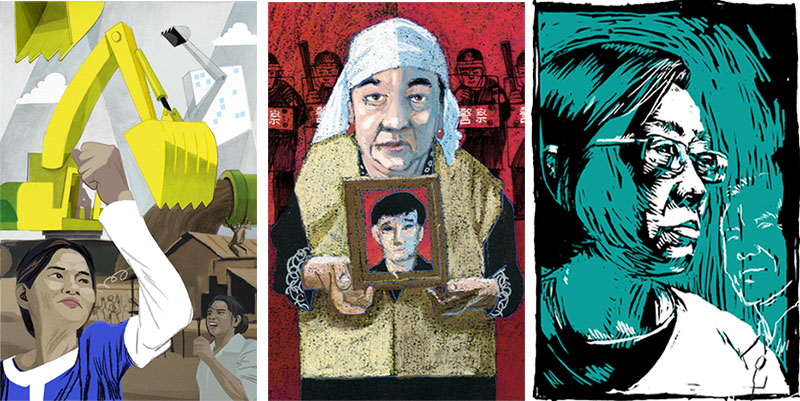

**Mixed media portrait of Gao Yu for Radio Free Asia's “It's Not OK: Women struggling for human rights” project. Gao Yu is a veteran journalist in China who has been repeatedly imprisoned but never silenced.**

I was invited to help illustrate RFA's book profiling women across Asia struggling for human rights.

We wanted to create a series of distinctive portraits, using a variety of mediums and techniques. This goal was rooted in both the desire to treat each story as unique as well as the practical limitations of using the available reference photos and videos. For some women we found an abundance of photos documenting their public struggles, for others we found virtually no visual reference, as they struggled alone.

### RESPONSIBILITIES

I created nine portraits for this project. I used a variety of mediums: pen and ink, watercolor, pastel, scratchboard, pencil, and computer to not only reproduce a likeness, but illustrate an individual story of courage. The initial goal was to publish the content exclusively as an ebook, but I suggested that we also present the content <a href='http://web.archive.org/web/20170702020700/http://www.womensrights.asia/' title="Internet archive snapshot of the site">online</a> and repurpose it as a <a href='http://www.blurb.com/b/6362951-it-s-not-ok-softcover?t=1438009925891'>printed book</a>. I designed <a href="http://web.archive.org/web/20170702020700/http://www.womensrights.asia/" title="Internet archive snapshot of the site">a simple responsive site</a> and helped design the print-on-demand edition.

