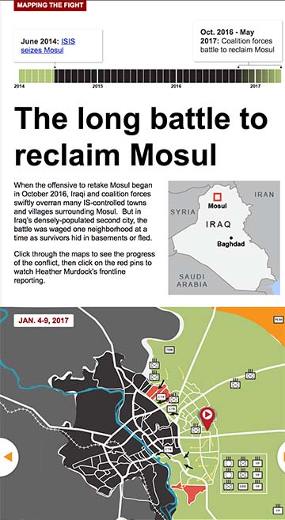

**Will the Iraqi government do any better in the aftermath of victory than its foes, or will another extremist force – be it tribal, ethnic, or sectarian – once again gain the upper hand. This collection of stories profiles the people who lived under the Islamic State, the battle to reclaim Mosul and looks ahead to the future.**

### RESPONSIBILITIES

VOA Middle East correspondent Heather Murdock, spent 2016 - 2017 covering ISIS in Syria and Iraq. As the liberation of Mosul drew near, VOA editors asked for a way to collect Murdock's reporting into a package to tell the stories of the families that lived under ISIS, as well as describing the history of the conflict and the future uncertainty. 

In addition to designing and coding the site, I created a step-by-step map showing how coalition forces were able to drive ISIS out of Mosul.